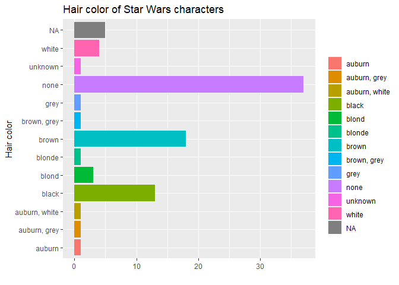
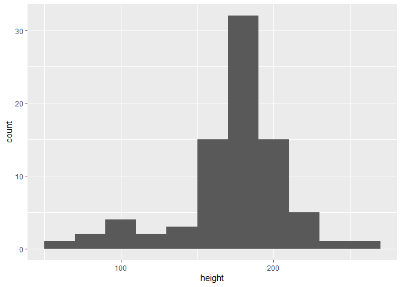
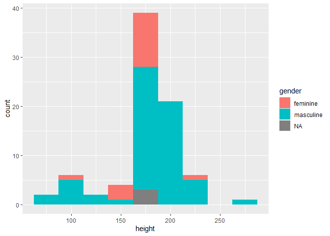
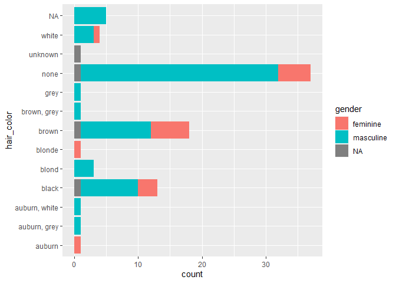
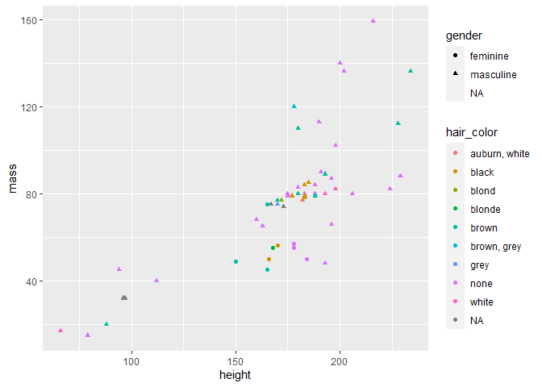

Visualizing Starwars characters
================
Stephanie Villaire

### Glimpse at the starwars data frame.

``` r
glimpse(starwars)
```

    ## Rows: 87
    ## Columns: 14
    ## $ name       <chr> "Luke Skywalker", "C-3PO", "R2-D2", "Darth Vader", "Leia Or…
    ## $ height     <int> 172, 167, 96, 202, 150, 178, 165, 97, 183, 182, 188, 180, 2…
    ## $ mass       <dbl> 77.0, 75.0, 32.0, 136.0, 49.0, 120.0, 75.0, 32.0, 84.0, 77.…
    ## $ hair_color <chr> "blond", NA, NA, "none", "brown", "brown, grey", "brown", N…
    ## $ skin_color <chr> "fair", "gold", "white, blue", "white", "light", "light", "…
    ## $ eye_color  <chr> "blue", "yellow", "red", "yellow", "brown", "blue", "blue",…
    ## $ birth_year <dbl> 19.0, 112.0, 33.0, 41.9, 19.0, 52.0, 47.0, NA, 24.0, 57.0, …
    ## $ sex        <chr> "male", "none", "none", "male", "female", "male", "female",…
    ## $ gender     <chr> "masculine", "masculine", "masculine", "masculine", "femini…
    ## $ homeworld  <chr> "Tatooine", "Tatooine", "Naboo", "Tatooine", "Alderaan", "T…
    ## $ species    <chr> "Human", "Droid", "Droid", "Human", "Human", "Human", "Huma…
    ## $ films      <list> <"The Empire Strikes Back", "Revenge of the Sith", "Return…
    ## $ vehicles   <list> <"Snowspeeder", "Imperial Speeder Bike">, <>, <>, <>, "Imp…
    ## $ starships  <list> <"X-wing", "Imperial shuttle">, <>, <>, "TIE Advanced x1",…

### Modify the following plot to change the color of all points to `"pink"`.

``` r
ggplot(starwars, 
       aes(x = height, y = mass, color = gender, size = birth_year)) +
  geom_point(color = "pink")
```

    ## Warning: Removed 51 rows containing missing values (geom_point).

<!-- -->

### Add labels for title, x and y axes, and size of points. Uncomment to see the effect.

``` r
ggplot(starwars, 
       aes(x = height, y = mass, color = gender, size = birth_year)) +
  geom_point(color = "pink") +
  labs(title = "Height and mass dimensions of Star Wars characters by birth year", x = "Height (cm)", y = "Weight (kg)", size = "Birth Year")
```

    ## Warning: Removed 51 rows containing missing values (geom_point).

<!-- -->

### Pick a single categorical variable from the data set and make a bar plot of its distribution.

(A little bit of starter code is provided below, and the code chunk is
set to not be evaluated with `eval = FALSE` because the current code in
there is not valid code and hence the document wouldn’t knit. Once you
replace the code with valid code, set the chunk option to `eval = TRUE`,
or remove the `eval` option altogether since it’s set to `TRUE` by
default.)

``` r
ggplot(starwars, aes(y = hair_color, fill = hair_color,)) +
  geom_bar() +
  labs(title = "Hair color of Star Wars characters", y = "Hair color", fill = " ", x = " ")
```

<!-- -->

### Pick a single numerical variable and make a histogram of it.

(This time no starter code is provided, you’re on your own!)

``` r
ggplot(starwars, aes (x = height)) +
  geom_histogram(binwidth = 20)
```

    ## Warning: Removed 6 rows containing non-finite values (stat_bin).

<!-- -->

### Pick a numerical variable and a categorical variable and make a visualisation (you pick the type!) to visualise the relationship between the two variables. Along with your code and output, provide an interpretation of the visualisation.

``` r
ggplot(starwars, aes(x = height, fill = gender)) +
  geom_histogram(binwidth = 25)
```

    ## Warning: Removed 6 rows containing non-finite values (stat_bin).

<!-- -->

### Pick two categorical variables and make a visualisation to visualise the relationship between the two variables. Along with your code and output, provide an interpretation of the visualisation.

``` r
ggplot(starwars, aes(y = hair_color, fill = gender)) +
  geom_bar()
```

<!-- -->

### Pick two numerical variables and two categorical variables and make a visualisation that incorportes all of them and provide an interpretation with your answer.

``` r
ggplot(starwars %>% filter (mass < 800), aes(x = height, y = mass, color = hair_color, shape = gender)) +
  geom_point()
```

    ## Warning: Removed 1 rows containing missing values (geom_point).

<!-- -->
